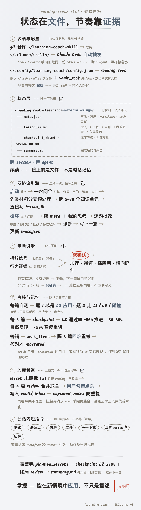

# learning-coach

一个把"读纸质书"换成"和 AI 交互式阅读"的学习教练 skill。让你用 Claude Code / Codex / Cursor 等 agent，按个性化节奏精读一本书 / 一篇博客 / 一份 GitHub 文档 / 一篇论文 / 一段播客转录，直到深度掌握（能在新情境中应用，而不只是复述）。

> An interactive reading coach skill for AI agents. Designed in Chinese, works with any agent that supports custom system prompts (Claude Code, Codex, Cursor, ChatGPT, etc.).

## 核心机制

- **逐篇分发**：AI 把材料拆成"独立知识单元"（不是按原章节），每篇 5–15 分钟阅读量
- **手动循环**：你说"继续"触发下一篇；状态全在文件，跨 session、跨 agent 续读
- **信号 + 证据双确认**：根据你的反馈措辞 **+** 自测表现共同决定是加速、减速、回炉，避免被措辞误导
- **三层考核（L1 复述 / L2 应用 / L3 批判）**：每篇必含 L2 应用题，避免"会背但不会用"
- **逐题批改 + 标准答案**：你答完自测 / 考核后，下一篇开头逐题给「原题 / 你的答 / 批改 / 完整标准答案」，写进文件可回看
- **三段式 KB 入库**（可选）：每篇末尾轻量标记候选 → 每 N 篇一次复盘节点（review）统一筛选 / 合并 / 取舍 → 学完终局整合，避免边学边入库的碎片化，AI 不擅自写入
- **会话内短指令**（v3）：学习中随口说"改成快读 / 展开 / 考一下我 / 回看 lesson N / 暂停"，即时调节节奏，不必等"继续"
- **碰撞式提问**（v3）：自测题可走"作者最想让你接受 X，你接受吗？"——接受则压最强反驳，不接受则三步定位，复用逐题批改机制
- **间隔重复防遗忘**（v3）：答错 / 勉强的题进 `weak_items`，隔几篇自动"回炉"重考
- **质量硬约束 + 自省**（v3）：每篇必含图 / 表 + 类比；coach 每到 checkpoint 自评"节奏判断准不准"，可审计自纠

## 架构图



## 文件布局

```
<reading_root>/                           # 学习根目录（config.reading_root，默认 ~/reading）
└── learning/
    └── <material-slug>/                  # 一份材料一个文件夹
        ├── meta.json                     # 用户画像 / 进度 / 调整日志 / 间隔重复 / coach 自省
        ├── lesson_01_<topic-slug>.md     # 含批改区块、讲解、自测、你的思考、入库候选
        ├── lesson_02_<topic-slug>.md
        ├── checkpoint_01.md              # 每 3–5 篇一次的深度考核
        ├── review_01.md                  # 每 N 篇一次的入库复盘 / 勾选清单
        └── summary.md                    # 完成后的骨架图 + 推荐下一份材料
```

## 安装

详见 [INSTALL.md](./INSTALL.md)，支持以下 agent：
- **Claude Code**（推荐，自动触发）
- **Codex CLI / Cursor / Cline** 等本地 agent（手动加载 system prompt）
- **ChatGPT / Claude.ai web**（仅内容复用，无法跨 session 续读本地状态）

## 跨 agent 复用矩阵

| Agent | 加载方式 | 自动触发 | 本地状态续读 |
|---|---|---|---|
| Claude Code | 软链到 `~/.claude/skills/learning-coach/` | ✅ | ✅ |
| Codex CLI | `codex --system-prompt-file SKILL.md` | ❌ 手动 | ✅ |
| Cursor / Cline | 复制内容到 `.cursorrules` 或 system prompt | ❌ 手动 | ✅ |
| ChatGPT / Claude.ai web | 复制内容粘贴到 system / 自定义 GPT | ❌ 手动 | ❌ 读不到本地文件 |

本地 agent 间无缝切换：Claude Code 写到 lesson_03 → Codex 续读 lesson_04 → 第二天换 Cursor 继续，**因为状态在文件不在对话里**。

## 配置

路径走外部配置，不用再手改 SKILL.md。建一个 `~/.config/learning-coach/config.json`：

```json
{
  "reading_root": "/你的/学习状态目录",
  "vault_root": "/你的/Obsidian/vault（启用 KB 时才需要）"
}
```

- 不填 `reading_root` → 默认 `~/reading`
- 不填 `vault_root` → 自动跳过 Obsidian KB 集成，其余协议照常

配置放在 `~/.config/`，与 skill 安装目录解耦——重装 / 更新 skill 不会动到它，私人路径也不进公开仓库。

## 设计理念

详细设计文档（信号+证据为何是双确认机制、为什么 L2 应用题必含、多材料分支怎么定的）见仓库的 `docs/`（待补），或读源 SKILL.md 即可——里面规则都有解释。

## 状态

- ✅ 阶段 1：skill 骨架（v2 协议，含信号+证据、多材料分支、L1/L2/L3、KB 候选+勾选）
- ✅ 阶段 2（v3）：会话内短指令 / 碰撞式提问 / 间隔重复 / lesson 排版强约束 / coach 自我反思 / 路径配置化 / 跨设备同步（reading 走 iCloud）
- ⏳ 阶段 3（待评估）：KB 现有笔记 wiki link 关联 / ljg-card 视觉卡 / ljg-learn 单概念深挖子模式 / YouTube·播客 URL 自动转录 / 用户思考质量评估

## License

MIT
